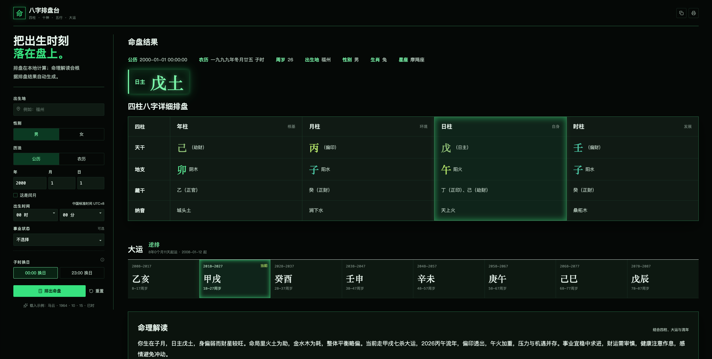
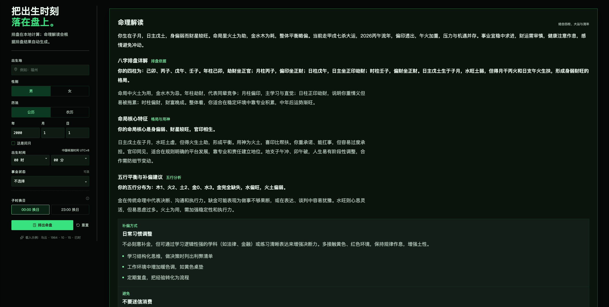
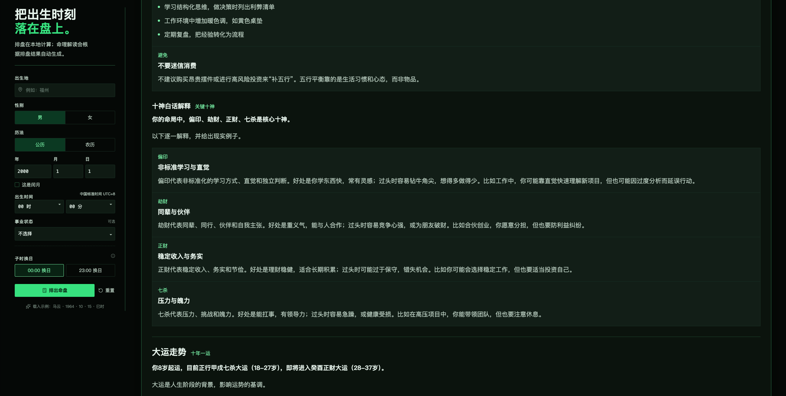

# 生辰八字命理解读 Skill

### 这是一个用于四柱八字排盘和命理解读的 Codex Skill。输入公历或农历出生日期、出生时间、性别和出生地后，可生成八字命盘，并结合大运、流年和现实事业状态进行自然、通俗的分析。

### 解读不会只说好话，也会说明命局中的优势、风险和需要注意的问题。五行会区分“缺失”和“偏弱”，十神会用白话解释，例如比肩、偏印、正财、七杀分别代表什么，并结合工作、学习、合作和生活场景举例说明。

## 网页功能

### • 支持公历、农历出生日期和出生时辰排盘。
### • 展示四柱、日主、十神、藏干、纳音、生肖、星座和五行结构。
### • 展示起运时间、顺逆排和每一步大运。
### • 可选择当前事业状态，让命理解读更贴近现实情况。
### • 解读一生事业、财运、夫妻感情、健康节奏、子女、父母、贵人和学业。
### • 支持切换流年，查看不同年份的机会、风险和行动建议。
### • 使用 DeepSeek 将排盘数据整理成更自然、详细、容易理解的中文内容。

## 功能截图

### 八字排盘与大运总览

### 命局解读与五行补偏建议

### 十神白话解释与大运走势

## 安装步骤

### 第一步：安装 Skill

### 将下面的链接发给 Codex，并让它安装这个 Skill：

### [https://github.com/CCBrother/shengchenbazi/tree/main/bazi-reading](https://github.com/CCBrother/shengchenbazi/tree/main/bazi-reading)

### 第二步：配置 DeepSeek API

### 前往 [DeepSeek 开放平台](https://platform.deepseek.com/) 注册账号，创建 API Key，并充值少量余额。一次命理解读通常只需几分钱，实际费用会根据模型价格、输入内容和输出长度变化。

### 在网页项目的 `.env.local` 中填写：

### `DEEPSEEK_API_KEY=你的_API_Key`

### `DEEPSEEK_MODEL=deepseek-chat`

### 重新启动网页服务后，排盘结果会自动生成自然语言命理解读，不需要额外点击其他按钮。

### 本项目用于传统文化研究与自我观察，不构成医疗、投资、法律或人生决策建议。
